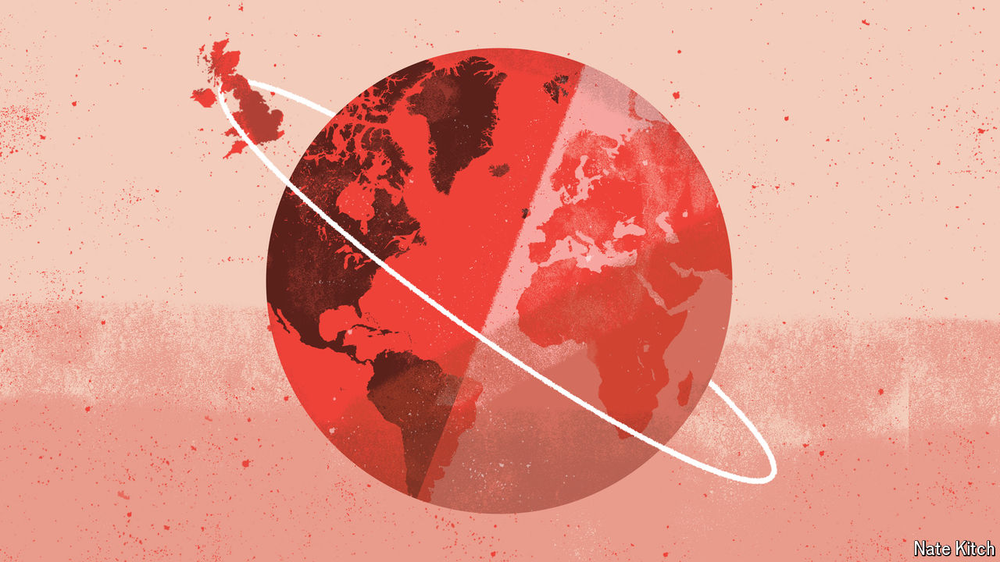

###### Bagehot

# What separates Tony Blair’s Labour from the party today? 

##### The approach to globalisation is the clearest dividing-line of all 

 

> Jun 12th 2024 

IT IS hard to imagine today’s shadow cabinet making a visit like that paid to Japan by , then leader of the opposition, in 1996. The delegation giggled as a businessman declared, in imperfect English, that he was looking forward to their big election, recalled Alastair Campbell, an aide. The future prime minister was later seen in his bedroom wearing only a pair of underpants and an earthquake helmet, pretending to speak Japanese. Like a university rugby club, New Labour was brainy but boorish. 


