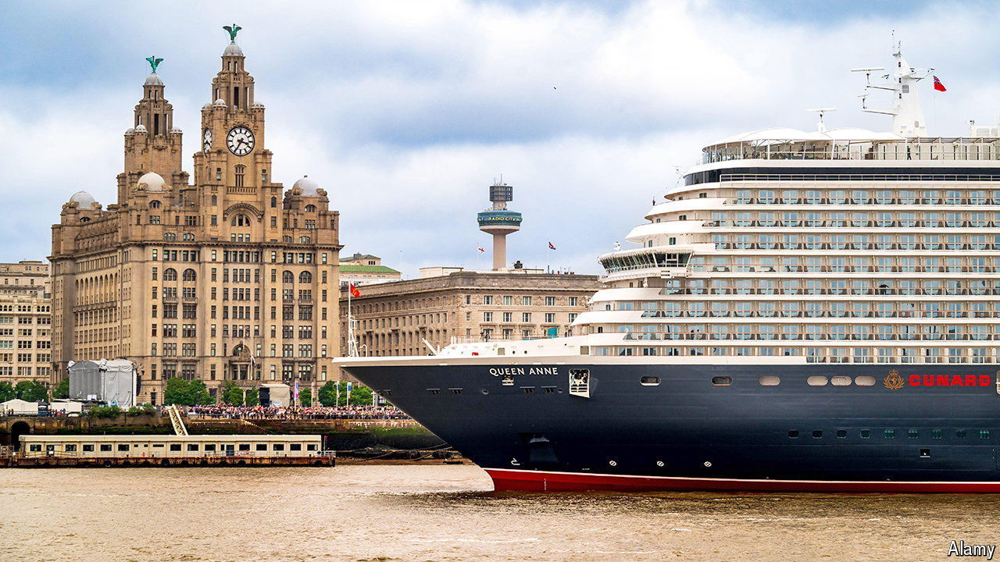

###### Lining up

# What unites a Spice Girl, an opera star and champagne? 

##### A cruise-ship launch in Liverpool 

 

> Jun 12th 2024 

Ship christenings are not short of pomp and circumstance. The naming ceremony for , a new ship owned by Cunard, a British cruise line, was no exception. Earlier this month officials in civic regalia joined crowds in Liverpool, Cunard’s one-time home. Mel C, a member of the Spice Girls, a British pop band, flashed peace signs; Andrea Bocelli, an Italian opera singer, performed alongside an orchestra. There were confetti cannon, prolonged blasts of the horn and the smashing of a 12-litre Laurent-Perrier champagne bottle against the ship. 

The maiden voyage of , whose 3,000 passengers can take part in yoga, cinema screenings and ballroom dancing, is well-timed. The covid-19 pandemic is largely in the cruise-ship industry’s wake. Cruisers from Britain and Ireland booked 2.3m trips in 2023, an increase of 14.5% on 2019, according to Cruise Lines International Association (CLIA), a trade body. Britain welcomed more than 2m cruise-ship passengers to its shores last year, 24% more than in 2019. 

