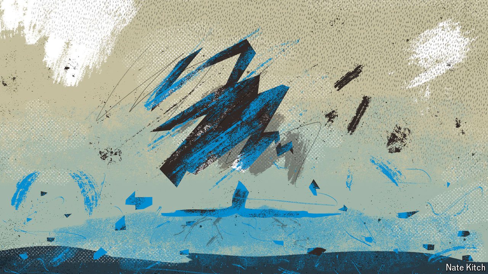

###### Conservative collapse

# What would a rout do to the Tories? 

##### A historic electoral defeat would be unlikely to prompt a speedy reckoning 

 

> Jun 13th 2024 

The votes had not all been counted by the time Sir John Major resigned as prime minister and retreated to the Oval to watch Surrey play cricket. Already, on that bright morning of May 2nd 1997, it was obvious that the Tories had been skittled. Nearly a third of the cabinet had been swept away overnight. It would turn out to be their worst performance in the modern democratic era; the party’s total of 165 seats was the lowest since it had split over free trade in 1906. 

The Conservatives may get an even bigger battering on July 4th. s  currently has them holding onto 187 seats—half the number they won in 2019. As predictions go, that is among the more generous. The party is set to be abandoned by somewhere between 7m and 9m of the 14m voters who backed it last time. Other pollsters say that could mean as few as 66 seats, in which case the Liberal Democrats could be nipping at Tory heels for second place. Apocalyptically minded Tories fret about a “Canada-style” wipeout, a reference to the election in 1993 in which their sister party won two seats. 

