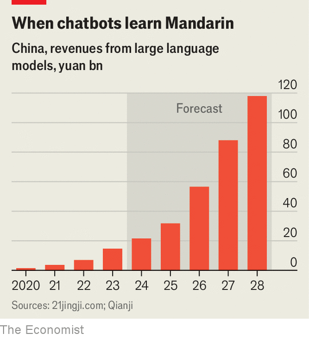

###### The LLM summer sale

# A price war breaks out among China’s AI-model builders 

##### It may stymie innovation 

 

> Jun 13th 2024 

PRICE WARS are ten a penny in China. The emergence of hundreds of lookalike companies seemingly overnight is pushing down retail prices of everything from electric vehicles to bike-sharing and bubble tea. The latest products to enter the ruinous fray are artificial-intelligence (AI) chatbots. This may seem surprising. Until recently China’s problem was not a surfeit of large language models (LLMs), the sort that makes ChatGPT a humanlike content-creator, but their dearth. At the start of 2023 experts reckoned that the Chinese LLMs that did exist were a decade behind the American cutting edge. 

 


