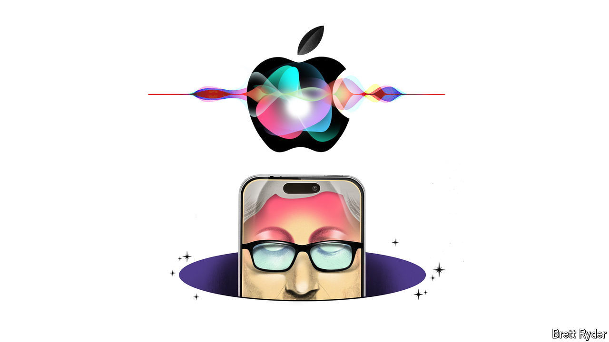

###### Schumpeter

# Hey Siri! Help me get Apple out of an AI-shaped hole 

##### Tim Cook’s prayer to the almighty 

 

> Jun 11th 2024 

Tim Cook has an air of bashful reverence. In his 13 years at the helm of  he has created more value than just about any CEO in history, as the tech behemoth’s market capitalisation has climbed from less than $400bn to around $3trn. But he still acts as if he were there thanks to the grace of , or the skill of his colleagues, or divine providence. It was in character, then, that when he took to the stage at the iPhone-maker’s annual developers’ gathering on June 10th, he first greeted the cheering throng by clasping his hands together, as if in prayer. He probably would not admit this, but there was plenty to pray for. 

Apple was suffering one of its periodic bouts of investor angst. Call it the curse of the missing mojo. In the previous 18 months Wall Street convinced itself—as it had a few times since Jobs died in 2011—that the creative spark bequeathed by Apple’s Promethean co-founder had finally sputtered out. Behind that is a real problem: sales of the iPhone, which account for half of Apple’s revenues, are slowing. But there is a perception problem, too. Apple’s aloof response to the euphoria over generative artificial intelligence (AI) cost it its crown as the world’s most valuable company, which it lost to its one-time nemesis, Microsoft. To make matters worse, the market value of Nvidia, maker of chips that power generative-AI tools, this month briefly overtook that of Apple. Its boss, Jensen Huang, is treated like the second coming of Jobs. 

