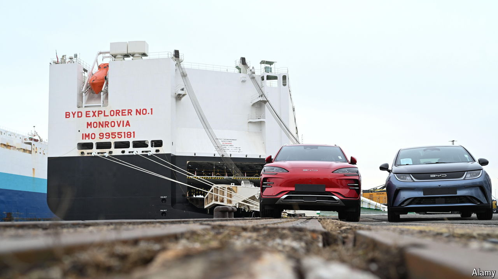

###### The call of duties

# The EU hits China’s carmakers with hefty new tariffs 

##### Duties will only hold them back for a while 

 

> Jun 12th 2024 

One satisfaction of buying a new car is the distinctive aroma within. The smell that emanates from the Chinese electric vehicles (evs) that are increasingly common on Europe’s roads is, for the European Commission, that of a rat. On June 12th, after an eight-month probe, the EU’s executive arm accused China of unfairly subsidising its industry with tax breaks, cheap loans and the like. It fears that cut-price imports pose a “clearly foreseeable and imminent injury” to European carmakers. Provisional tariffs of between 26% and 48%, compared with 10% for other imported cars, will be imposed from July on Chinese evs. The precise duty will depend on each firm’s willingness to assist the investigation. 

In the short term, it is hard to sniff out a winner. Car buyers hoping to inhale the intoxicating new-car odour will certainly suffer if the prices of imported cars rise and competitive pressures on European firms ease. But Europe’s carmakers are not taking a victory lap, either. They did not ask for the probe, which was launched under pressure from France’s government. German companies such as Volkswagen and BMW, which make lots of cars in China and export plenty there, have been particularly vocal opponents. Now they fear retaliation from Beijing, which looks inevitable. 

