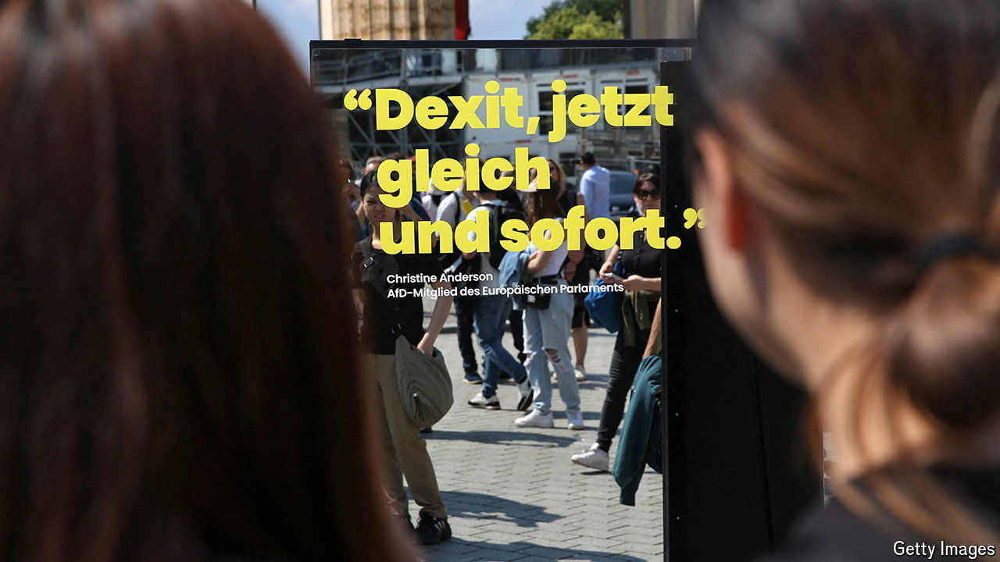

###### Wrongs of the right

# The rise of the far right alarms German business leaders 

##### At least, most of them 

 

> Jun 13th 2024 

When the Alternative for Germany (AfD, from its German initials) was launched in 2013, it was a pro-business, classically liberal party created by German intellectuals opposed to the single European currency. Hans-Olaf Henkel, a free-market enthusiast and former boss of the bDI, the main German industry association, was a founding member. 

Then, in the space of a few years, the AfD turned into an anti-immigrant, populist party toying with Dexit—Germany’s exit from the eu. Mr Henkel quit in 2015. German bosses turned their backs. Despite being generally reluctant to voice political opinions, many came out strongly against the AfD ahead of the election to the European Parliament on June 9th. 

