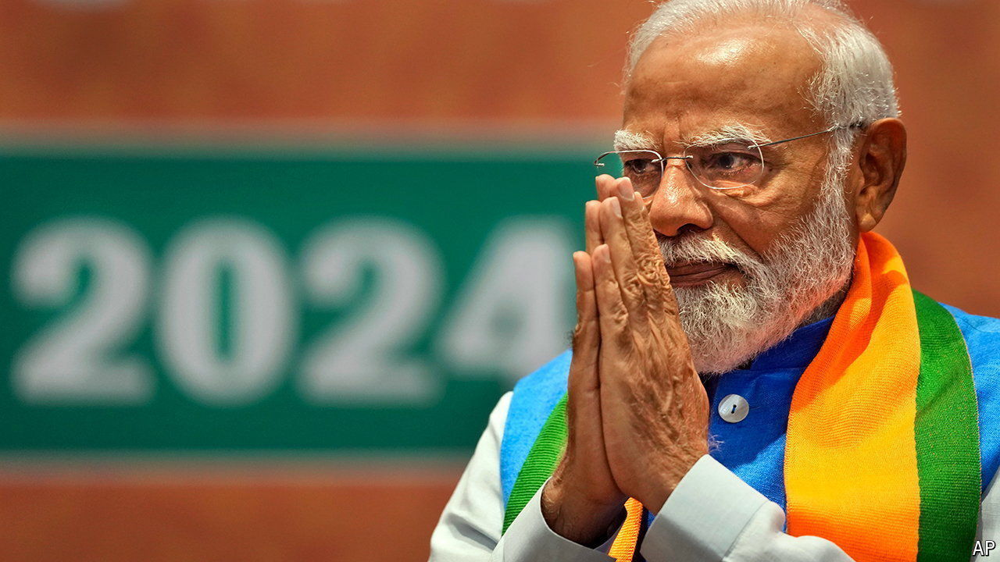

###### Mumbai mood swings

# What Indian business expects from Modi 3.0 

##### After a brief panic, investors and bosses welcome the new government 

 

> Jun 13th 2024 

HOW MUCH is one-party rule worth to India Inc? Judging by the market reaction to the results of the general election, the figure is around $400bn. That is the total market value lost by Mumbai-listed stocks on June 4th, when it turned out that rather than securing a big majority, as exit polls had predicted, the ruling Bharatiya Janata Party (BJP) of Narendra Modi would need coalition partners to govern. 

Investors’ panic proved short-lived. By June 10th the Mumbai bourse had clawed back all its losses, after Mr Modi quickly assembled a coalition perceived to be sympathetic to his pro-business economic agenda. The previous day a “Who’s Who” of corporate India applauded in the presidential palace as Mr Modi was sworn in as prime minister for a third time. Modi 3.0, as Indians refer to the new government, is looking much like the earlier versions.

