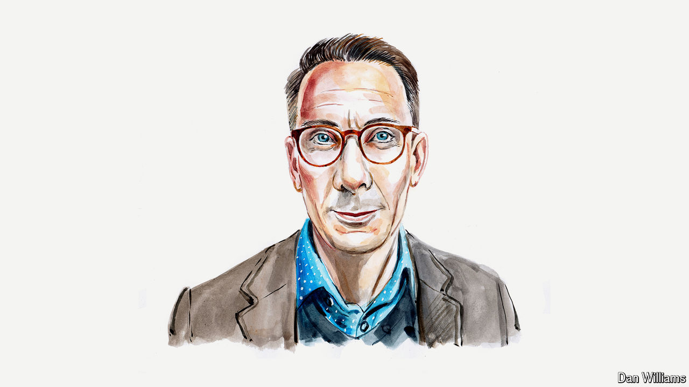

###### Crypto-criminality

# Digital finance is a money-launderer’s dream, argues an author 

##### Curbing dirty money will require both governments and techies to be less dogmatic, says Geoff White 

 

> Jun 10th 2024 

CUTTING-EDGE FINANCIAL technology is fast becoming the handmaiden of organised crime, helping some of the world’s most dangerous crooks to move and hide ill-gotten gains. This situation will only get worse, unless governments and the technology industry can find common ground.

Money-laundering has a history almost as long as crime itself. But it became much more sophisticated during the cocaine-cowboy era of the 1980s, when narcotics flooded into America.

