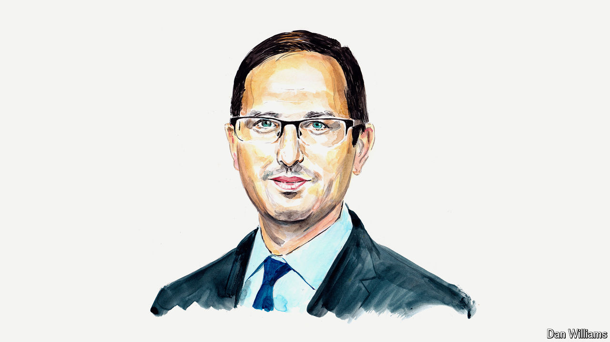

###### A moderate proposal

# Why political centrists must rediscover their passion 

##### They need to be clear about what opposing populism does and doesn’t mean, argues Yair Zivan 

 

> Jun 11th 2024 

WILLIAM BUTLER YEATS’S “The Second Coming” was written as a warning about the state of the world. Although “Things fall apart; the centre cannot hold” has perhaps become the most famous line of his poem, it is two other lines that should concern us all. As an estimated 2bn people across the world head to the polls in 2024, Yeats’s warning that “the best lack all conviction” while “the worst are full of passionate intensity” resonates loudly.

Democracies are being torn apart by extremism and . The gains made by the  in recent days are only the latest sign of the rising dangers of populism. Its impact will continue to be felt across European politics for years to come.

