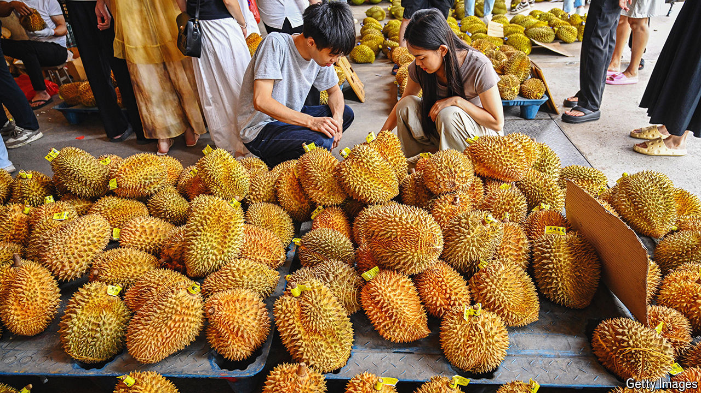

###### A whiff of diplomacy

# China is going crazy for durians 

##### Locals love the pungent fruit. The government sees an opportunity 

 

> Jun 13th 2024 

ERIC CHAN has long sold durians, a pungent fruit, to South-East Asians. Now he is eyeing a bigger prize. The Musang King variety that he cultivates in Malaysia is beloved by Chinese consumers. But at the moment his country only has permission to export frozen durians to China, where many want them fresh. In total, Chinese foodies gobbled up $6.7bn-worth of imported fresh durians last year, up from $4bn in 2022 and $1.6bn in 2019, the year durians overtook cherries as China’s largest fresh-fruit import by value.

Apart from a love of the fruit, two shifts help to explain China’s increasing appetite for durians. The first is the growth of the country’s middle class. More and more Chinese are able to afford durians, which are not cheap. An average one from Thailand, the supplier of much of China’s stock, can sell for around 150 yuan ($20). The Musang King variety can fetch up to 500 yuan each. (A durian is often big enough to be shared by two people.)

