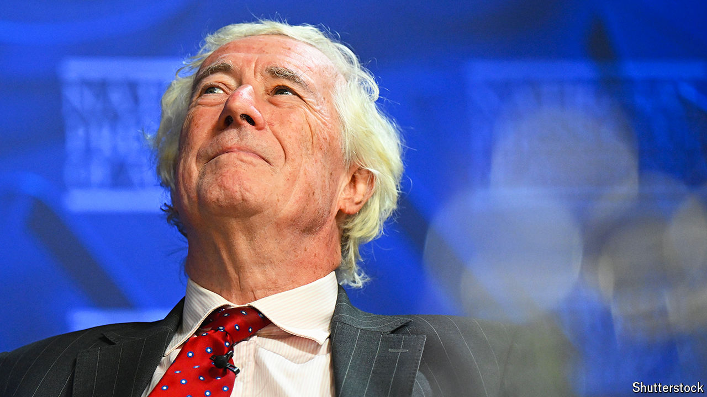

###### Passing judgment

# Foreign judges are fed up with Hong Kong’s political environment 

##### Three have left the city’s highest court this month 

 

> Jun 13th 2024 

IT IS AN unusual arrangement, to be sure. Since its establishment in 1997, the Court of Final Appeal in Hong Kong has had both local and foreign judges on its bench. The set-up was part of the deal that handed the territory from Britain to China that year. The foreigners, who hold non-permanent seats, tend to have impressive legal backgrounds and come from other common-law jurisdictions, such as Britain, Australia and Canada. So they are accustomed to exercising judicial power “independently and free from any interference”, as laid out in the territory’s mini-constitution, called the Basic Law.

The court still operates largely as envisioned. But Hong Kong’s leaders are growing more oppressive, forcing the foreign judges to make a tough choice. Three out of ten on the Court of Final Appeal have resigned this month. Two British judges, Jonathan Sumption (pictured) and Lawrence Collins, jumped first, noting the deteriorating political situation. Days later a Canadian judge, Beverley McLachlin, said she would also depart, citing personal reasons. Lord Sumption, hitherto a defender of the role of foreign judges on the court, explained his thinking in the . Most of Hong Kong’s judges are “honourable people with all the liberal instincts of the common law”, he wrote. “But they have to operate in an impossible political environment created by China.” 

