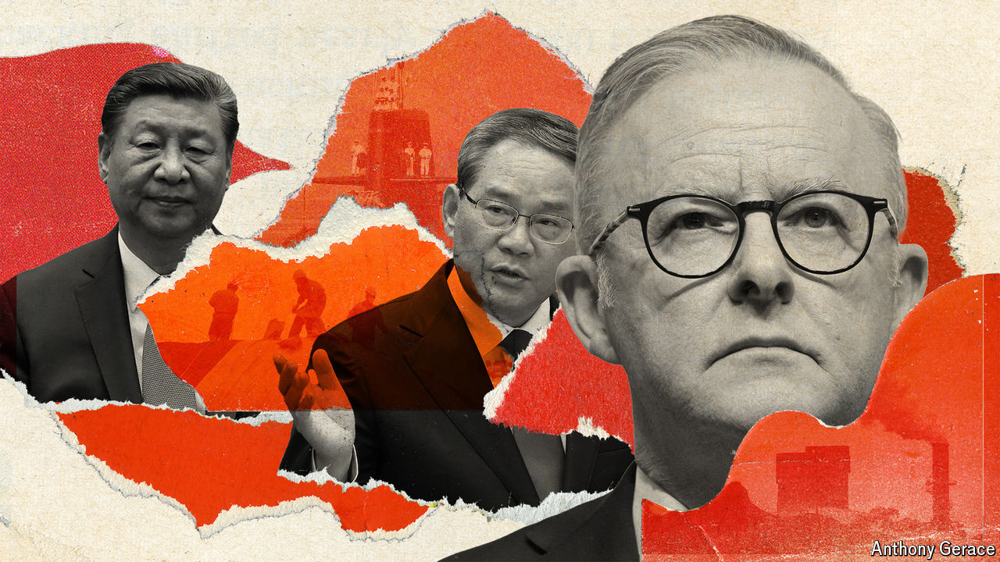

###### From wolf warrior to panda-pusher

# Li Qiang and China look to make up with Australia 

##### The superpower is seeking to ease tensions with at least some of America’s allies 

 

> Jun 13th 2024 

“My government is pro-panda,” said Australia’s prime minister, Anthony Albanese, as he prepared to host the highest-ranking Chinese visitor to his country in seven years. Mr Albanese was simply referring to the bears that China has lent to Australia’s Adelaide Zoo. Still, such sound-bites had long been rare before he was elected in 2022. Relations between China and Australia had suffered years of acrimony. The mood is now much changed. During his four-day trip to Australia, beginning on June 15th, China’s prime minister, Li Qiang, will be keen to show that even with one of America’s closest allies, cordial ties are possible.

In China’s political hierarchy, Mr Li is a distant number two to the president, Xi Jinping, who last visited Australia a decade ago. But his trip has much symbolic importance. Under Australia’s previous governments, China hawks held sway. Relations turned particularly sour in 2017 when the prime minister at the time, Malcolm Turnbull, tried to clamp down on Chinese attempts to exert covert influence in Australia. He introduced laws aimed at curbing this. In 2018 he also took the lead among Western powers by banning  in the building of advanced 5G communications networks. His successor, Scott Morrison, infuriated China by calling for an international investigation into the origins of covid-19. China responded with sweeping restrictions on Australian exports to China. Mr Li’s visit is a clear sign that both countries want to move on. 

