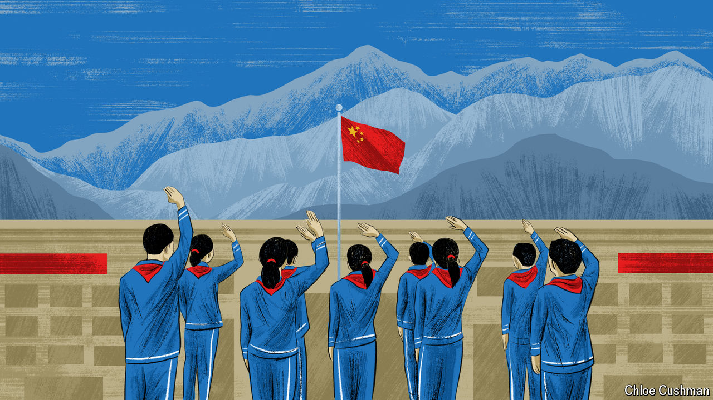

###### Chaguan

# Why China takes young Tibetans from their families 

##### Visiting a Tibetan region where children must attend Chinese-language boarding schools 

 

> Jun 13th 2024 

AN AIR OF quiet piety hangs over Rongwo Monastery in the western province of Qinghai. The streets near this ancient complex draw pilgrims and Tibetan Buddhist monks in dark red robes. Local believers make circuits around the monastery’s yellow walls, turning a line of wooden prayer-wheels as they walk.

On a recent Monday afternoon, though, chattering schoolchildren thronged this sacred neighbourhood in the heart of Tongren, a small mountain city known to Tibetans as Rebkong. Youngsters in red scarves and uniform tracksuits bought fruit and snacks from market stalls, most without a parent in sight. Teenage high-schoolers and pupils half their age hauled small suitcases or sat in weary groups beside piles of schoolbags, bringing the bustle of a railway station to streets around the monastery.

