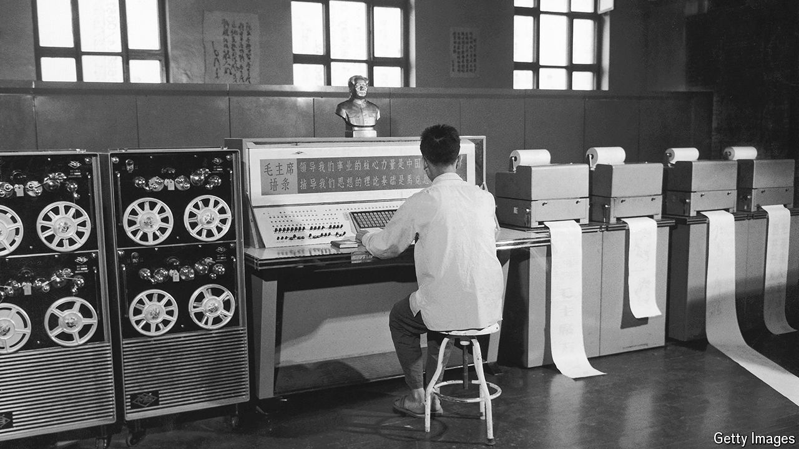

###### Keyboard warriors

# How Chinese computing nerds cracked a linguistic conundrum 

##### Specifically, how to write Chinese characters using a Western keyboard 

 

> Jun 13th 2024 

 By Thomas Mullaney. 

The National Chinese Characters Typing Competition is rarely cause for excitement, but in 2013 it was. Huang Zhenyu, a student, produced 222 characters per minute, or 3.7 per second, the equivalent of someone typing more than 200 words per minute in English. (The average typist manages about 40 English words per minute.) Mr Huang’s performance was a dramatic moment in one of the Chinese-speaking world’s long-running challenges: how to use the 26 letters on the Western QWERTY keyboard to type thousands of Chinese characters. 

