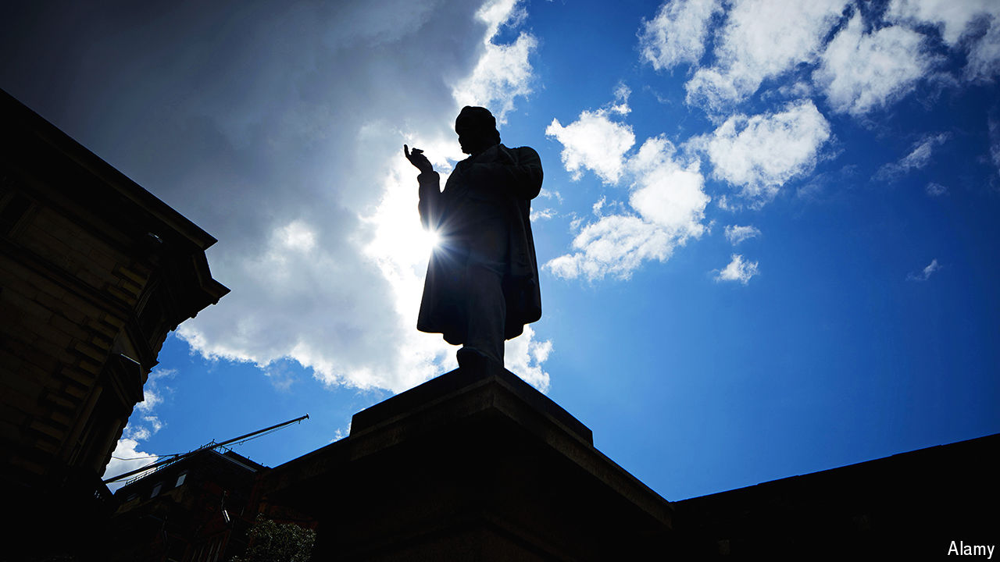

###### A peace offering

# How left-wingers abandoned free trade 

##### Given its poverty-busting record, they should not have done 

 

> Jun 13th 2024 

By Marc-William Palen. 

FOR MOST of modern political history, free trade has been a radical idea.  was founded in 1843 to campaign against the , tariffs on Britain’s grain imports which kept food expensive for the poor while enriching landowners. We were allied with the Anti-Corn Law League, a group formed in Manchester and led by Richard Cobden, a pacifist who saw tearing down trade barriers as the ultimate anti-nationalist, anti-imperialist project. But Cobdenism was so radical—populist, even—that James Wilson, our founder, tried to keep the League at arm’s length. He would convince the elites that food tariffs should be abolished. Cobdenism was for the masses; its disciples would later pair the principles of “ and Manchester”. 

