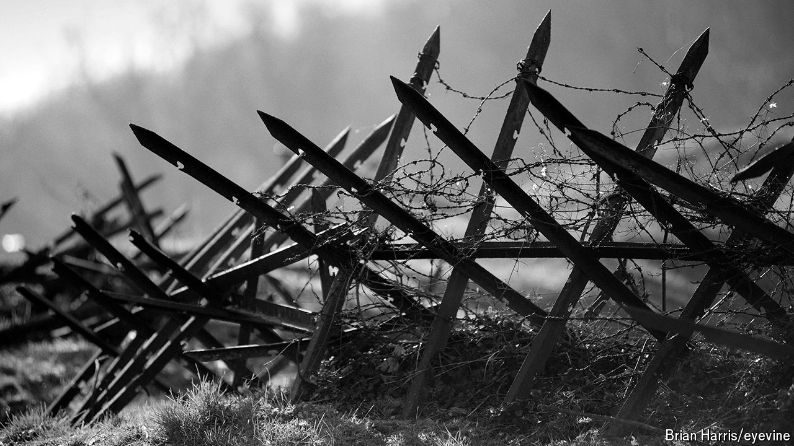

###### Monster, Inc?

# Is now the right time to publish a novel by Louis-Ferdinand Céline? 

##### A newly translated book by an antisemitic French novelist is sure to spark debate 

 

> Jun 13th 2024 

Ferdinand wakes up on a battlefield, his ear glued to the ground with blood. The mud around him is littered with shells. He is unable to move his arm, and there is a terrible ringing in his ears “like a train”. The noise will never leave him, for it is Belgium in 1915, and Ferdinand has “caught  in my head”. Nearby a man has exploded “like a grenade”; two rats live in what is left of his abdomen. 

This is the opening passage of “Guerre” (“War”), a long-lost novel by Louis-Ferdinand Céline. It has been translated into English for the first time, with two new translations released in June. The tale is largely autobiographical. Born in 1894, Céline was wounded in Flanders at the start of the first world war. He recounted the horrors of conflict in his fiction, writing in a colloquial style characterised by its slang, gutter jokes and bleak view of humanity. 

