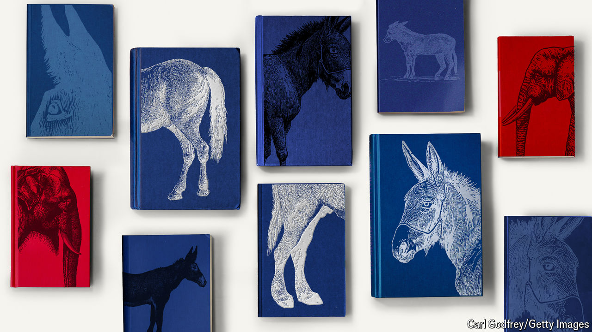

###### Tipping the sales

# Is the New York Times bestseller list politically biased? 

##### Our investigation suggests it is 

 

> Jun 11th 2024 

“The  is pure propaganda,” tweeted , a tech mogul, in March. Mr Musk was responding not to the newspaper’s coverage of his companies or of Donald Trump, but rather to the newspaper’s latest bestseller list. , a social critic, about the hypocrisy of America’s elite, had been excluded from the hardcover non-fiction list despite selling 3,765 copies in its first week. According to data from Circana Bookscan, a firm that claims to track 85% of print book sales in America, “Troubled” outperformed the books that ranked in the fourth and fifth slots that week. Many saw the omission as a sign of political bias. 

Such criticism is not wholly new. The which has kept a tally of  since 1931, came under fire in 1983, when William Peter Blatty, author of “The Exorcist”, sued the paper for omitting his book “Legion” from the fiction bestseller list. (His case was eventually dismissed.) And last year , who has had nearly 290 bestsellers, complained that the paper was “cooking the books” when a non-fiction title of his did not make the cut. Like Coca-Cola, the guards its proprietary formula; exactly which retailers report sales, how they are weighted and which sales are screened out is shrouded in mystery. 

