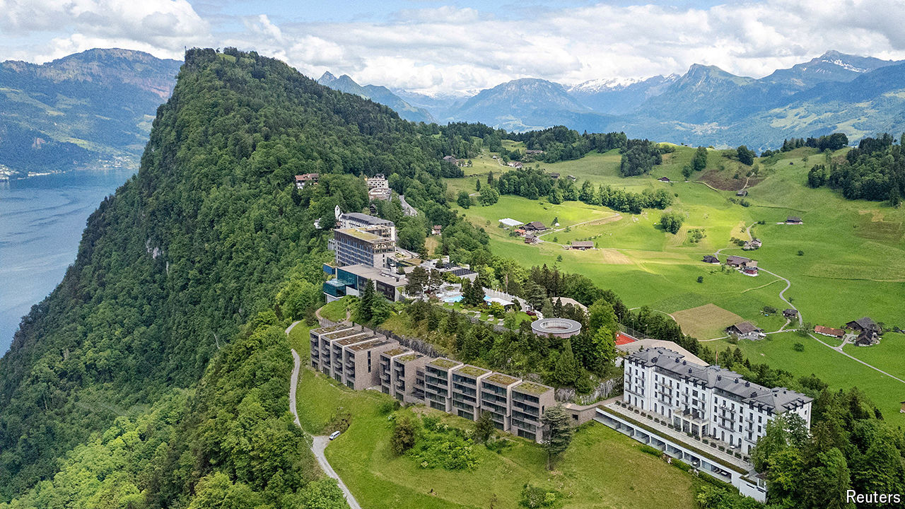

###### Peace for Ukraine?

# A peace conference over Ukraine is unlikely to silence the guns 

##### Serious negotiations are unlikely to begin before the year’s end at the earliest 

 

> Jun 13th 2024 

IT WAS MEANT to be a big show, a historic conference on the 500th day of the war, and one that just might end it. But from the very start Volodymyr Zelensky’s Global Peace Summit has run into problems. Delayed five times, it was finally scheduled for June 15th and 16th, respectively days 843 and 844 of the conflict. Now, with flags ready to be hoisted in the Swiss resort of Bürgenstock, the worry is that the guest-list is not long or high-level enough. Russia was never meant to be there. But snubs from the Chinese and from President Joe Biden have been obvious blows, and have prompted public rebukes from Mr Zelensky. Vladimir Putin would be applauding Mr Biden’s absence, he snapped.

Mr Zelensky’s temper grated on some of his own officials, who privately criticise the president’s “diplomatic naivety”. A former member of his government suggests the outburst showed he was “too nervous” and looking for scapegoats to cover up mistakes. “Diplomacy isn’t meant to be fun,” he complains. “It’s meant to be serious.” A more charitable serving official says the summit’s teething problems stem from Mr Zelensky’s “maximalism”. The president’s ambitious ideas, he observes, don’t always fly. “But if he sets the goals lower, nothing comes of them at all.”

