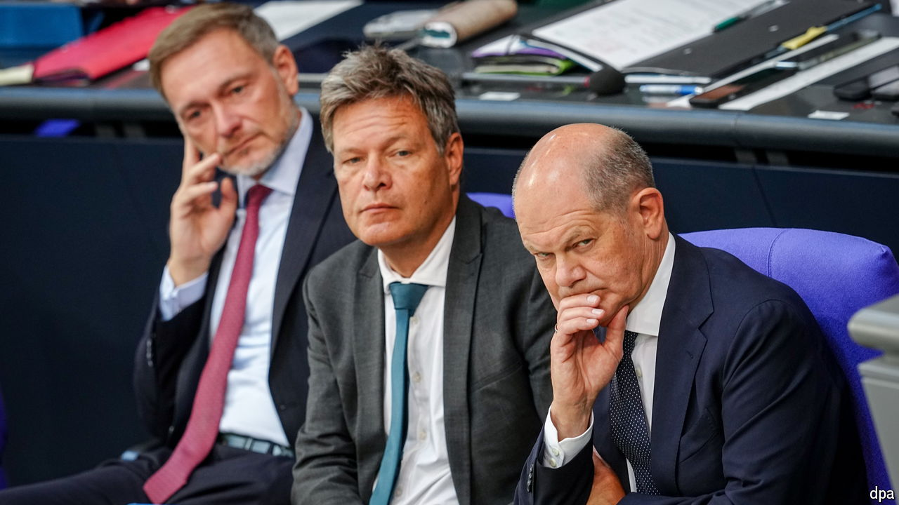

###### European elections

# Beyond France, the European elections will deliver more of the same 

##### Outside France and Germany, the centre has largely held 

 

> Jun 13th 2024 

Elections across Europe in recent years have often been a case of gauging the dwindling ability of centrist political forces to contain the rise of parties on the hard right. The continent-wide European Parliament elections held between June 6th and 9th marked another twist: a strong rise of nationalist support in France and Germany, even as their allies in the rest of the bloc made few inroads. The political centre has been dented, but it still holds. 

As the results trickled out on June 9th, the focus was on France, thanks to Emmanuel Macron’s decision to call national parliamentary elections after the National Rally (RN) of his arch-rival Marine Le Pen routed Mr Macron’s liberals. The RN had already topped the EU vote in 2014 and 2019; its margin this time was so wide that its 30 MEPs will be the biggest delegation to the 720-seat parliament in Brussels.

