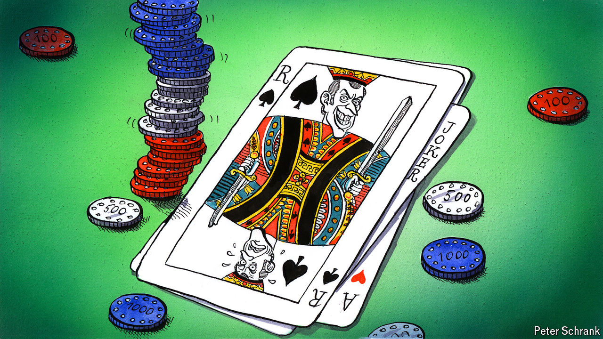

###### Charlemagne

# No wonder Macron’s gambling: Europe is home to the high-roller 

##### You gotta bet big to win big in Europe 

 

> Jun 13th 2024 

Fancy a flutter? Placing €10 on Germany to win the European football championships it is hosting from June 14th could net you a handsome €60 profit. Those looking for a bigger payout can punt on long-shots like Georgia or Albania at 1000 to 1. Feeling luckier than that? For the thrill-chaser in search of that certain , there is an altogether more daring bet on offer, at least to presidents of France: wagering the political future of your country and that of Europe, and throwing your own legacy into the mix as well. Gulp. Emmanuel Macron’s surprise announcement on June 9th that he was calling a snap parliamentary vote—just hours after his party got trounced in the European elections—has all the hallmarks of a compulsive gambler thinking a bad run can be fixed with just one last roll of the dice. The decision looks rash. It is also archetypally European. This is a continent where muddled politics means you must bet big to win big. 

Politicians defiantly demanding voters either back ’em or sack ’em is one of those gory European specialities, like bullfighting or Balkan politics. Whereas in America elections are held at fixed intervals, in many European countries leaders can call votes to suit their purposes or flatter their egos. A stretch in the White House is enough to enter the history books. In Europe the incessant coming and going of leaders means staying around for a decent stint, and preferably getting something done, is necessary to be remembered. (Clever wags poked fun at Liz Truss for having the shelf-life of a lettuce; Gabriel Attal, the French prime minister since January, may turn out to have lasted barely longer than the open packet of crisps at the back of Charlemagne’s pantry.) Thus the incentive is to be rash, especially if things are not going well. Double down! Call an election! Change the constitution! Occasionally this works. All too often the gambit fails and its instigator is quietly forgotten, banished to seldom-visited bits of Wikipedia.

