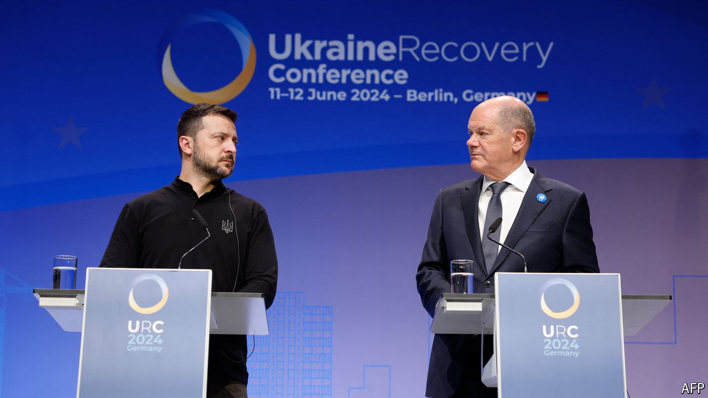

###### Build back better

# Politics overshadows a conference to raise money for Ukraine 

##### Not to mention the continued fighting 

 

> Jun 11th 2024 

THE TITLE of the Ukraine Recovery Conference that opened on June 11th in Berlin may seem overly hopeful. For the moment there is still a lot more destruction than  going on in the country, and most of the attention is on providing resources to keep things from deteriorating any further. Russian drones and missiles have knocked out half of the 18 gigawatts of power-generating capacity that Ukraine had before last winter. Volodymyr Zelensky, Ukraine’s president, speaking at the conference, pleaded for help in decentralising the country’s  (with generators, solar panels and wind turbines), and for more air-defence systems. Olaf Scholz, Germany’s chancellor, obligingly announced he would give the Ukrainians a third Patriot missile battery.

The longer-term questions are how to restore Ukraine’s economy to prosperity, and how to fund both the ongoing costs of government and the  of the country. The World Bank estimated the cost of repairing the destruction wrought by the war at $486bn as of last winter, and that number does not include the recent damage to the power system. Ukraine’s entire government budget for 2024 is $87bn (about half of it is spent on defence), but its expected tax revenues come to only $46bn. The rest must be filled by foreign aid or borrowing. America’s approval in April of its long-delayed $61bn aid package for Ukraine will help, as does the EU’s €50bn ($54bn) aid package, which lasts until the end of 2027.

