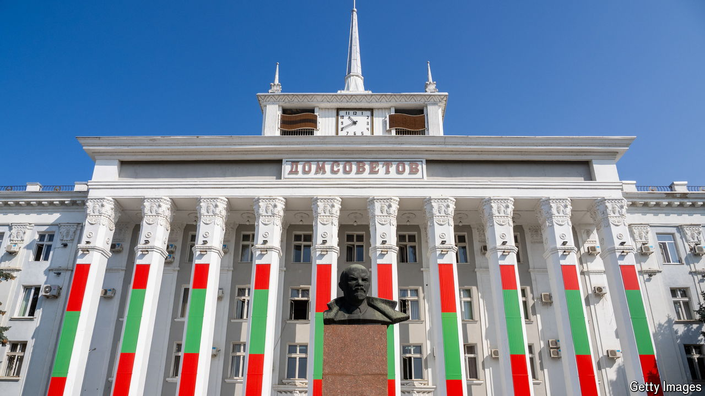

###### Too thin to survive?

# The tiny statelet of Transnistria is squeezed on all sides 

##### But so far Russia has been unable to gobble it up 

 

> Jun 13th 2024 

“Everyone is welcome, except journalists,” announces the guide as her group have their passports checked on entering Transnistria, a diminutive pro-Russian breakaway enclave that belongs in international law to Moldova. Russian soldiers stand on one side of the road, Moldovans on the other. It is peaceful enough. But ever since Russia’s full-scale invasion of Ukraine began, Transnistrians’ fears that their statelet might become a new front in that war have been very real. 

In the centre of Tiraspol, the region’s capital, the flags of two breakaway chunks of Georgia, the only statelets to recognise Transnistria’s independence, fly alongside its own one. Russia, whose flag flutters widely elsewhere, helped prise Transnistria from Moldova in the early 1990s. Everyone assumes that its fate depends on whether Ukraine stands or falls.

