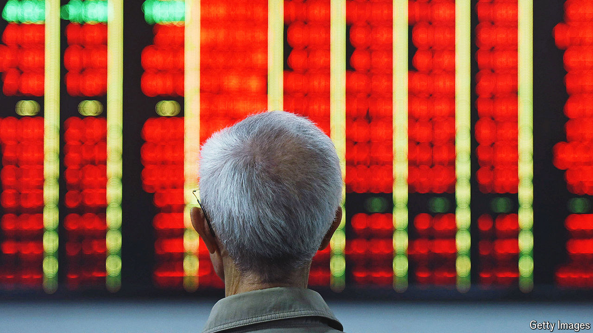

###### In the stocks

# China is distorting its stockmarket by trying to prop it up 

##### State purchases of shares are bad enough, but other measures are far more destructive 

 

> Jun 10th 2024 

Investors in China’s stockmarket have been doing handsomely this year. The Shanghai composite index has risen by 12% from a multi-year low in February, notwithstanding a recent drop. Equity analysts and state media alike are cheering. For Xi Jinping, China’s leader, the rally was a relief, since retail investors own at least 80% of the market. A previous rout hurt them badly, adding to anxieties about the country’s future. To many, the recovery reflected good governance and fortune.

Part of the rally came from the purchase of tens of billions of dollars’ worth of shares by the “national team”, a group of state-owned institutions that ride to the rescue when China’s markets wobble. For Mr Xi, the bill may appear worth it. But the state has also tinkered with the market in other, more destructive ways. In an effort to boost share prices, it has put an end to a bonanza in initial public offerings (IPOs). With fewer exit opportunities for private investors, state capital has become more dominant. The danger is that these distortions will crimp the growth of China’s most innovative firms.

