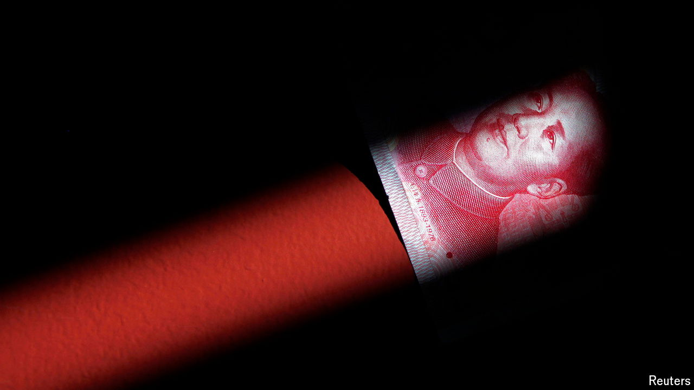

###### Dropping anchor

# China’s currency is not as influential as once imagined 

##### Its share of international reserves has stalled 

 

> Jun 13th 2024 

Chinese officials seem pleased with the yuan’s recent progress as a global currency. The international monetary system is diversifying at an accelerating pace, said Pan Gongsheng, the governor of China’s central bank, in March. The yuan has become the fourth-most active currency in global payments, he noted. In trade finance, it now ranks third. And according to the central bank’s data, about half of China’s transactions with the rest of the world (for financial assets, as well as goods) are now settled in yuan.

Despite these gains, the yuan’s global position still looks modest compared with past expectations. In the wake of the financial crisis of 2007-09 it was easy to imagine a bigger role. In 2008 Fred Hu, then of Goldman Sachs, predicted the yuan would account for 15-20% of foreign-exchange reserves by 2020. More memorably, “Super Sad True Love Story”, a novel written by Gary Shteyngart and published in 2010, imagined a dystopian future in which a tottering America had pegged the crumpled dollar to the mighty yuan.

