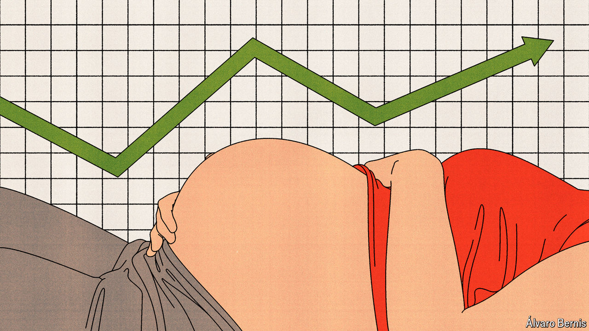

###### Free exchange

# Does motherhood hurt women’s pay? 

##### Two new studies suggest not—at least in the long run, and in Scandinavia 

 

> Jun 13th 2024 

Returning from his paternity leave last week, your columnist was keen to get writing. After all, numerous studies say parents’ careers can suffer after they have children. Best to immediately dispel any notion that his might do so. But then he remembered that he is a man, and went to get a coffee. For the child penalty, as the career hit is known by economists, is commonly believed to affect mothers alone.

In fact, it might be that women returning to work after childbirth can afford to relax, too. It is true that their immediate earnings are likely to fall, and perhaps infuriating that those of new fathers are not. Yet two new studies suggest that, in the long run, compared with women who do not have children, the motherhood penalty may vanish—or even turn into a premium.

