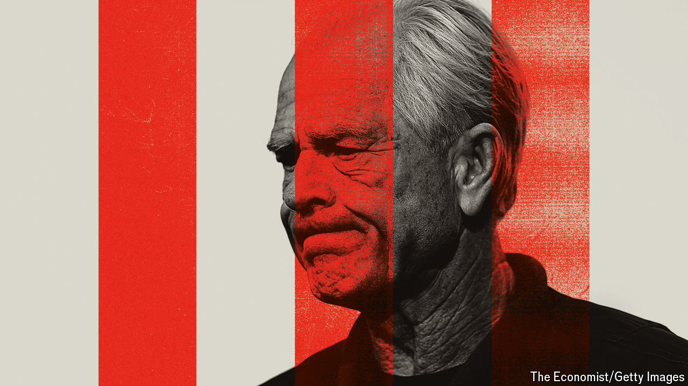

###### The caged bird sings

# Donald Trump’s trade hawk is plotting behind bars 

##### Peter Navarro’s dark vision of the global economy could shape Trump 2 

 

> Jun 11th 2024 

Ahead of America’s election in November, company bosses, financiers and diplomats are busy calling on Donald Trump’s allies, trying to divine the  the former president will pursue if he is re-elected. But there is one man in Mr Trump’s orbit who holds more sway than most and who, for now, is virtually inaccessible. That is because he is inmate number 04370-510 in the Federal Correctional Institution of Miami.

Peter Navarro, a leading economic adviser in Mr Trump’s first administration, is more than halfway through a four-month sentence for contempt of Congress. He bristles with indignation at the justice system, disdains Joe Biden’s record and longs to steer America towards hardline protectionism. In written correspondence with , Mr Navarro has laid out how he thinks Mr Trump should approach trade—from turning up the heat on China to slapping tariffs on just about everyone else. It is a dark, angry vision for the global economy. As polls stand, it is one Mr Navarro may shortly be able to promote from inside the White House.

