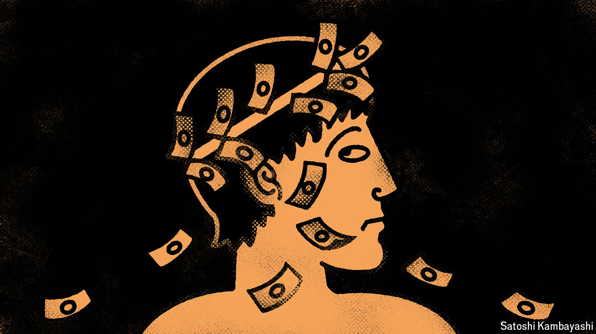

###### Buttonwood

# Has private credit’s golden age already ended? 

##### A more competitive market is a less profitable one 

 

> Jun 13th 2024 

The HISTORY of leveraged finance—the business of lending to risky, indebted companies—is best told in three acts. High-yield (or “junk”) bonds were the subject of the first. That ended in 1990 when Michael Milken, the godfather of this sort of debt, was sent to prison for fraud. In the second act, the extraordinary growth of private equity was financed by both junk bonds and leveraged loans, which require companies to pay a floating rate of interest rather than the fixed coupons on most bonds. Private-credit investors are now supplying the third wave of money. Since 2020 such firms, which often also run private-equity funds, have raised more than $1trn. When interest rates rose in 2022 and banks stopped underwriting new risky loans, private credit became the only game in town. Wall Street chattered that its “golden age” had begun.

America’s $4trn leveraged-finance market now comprises junk bonds, leveraged loans and assets managed by private-credit firms, in roughly equal proportions. Yet owing to fierce competition to refinance debt and fund scarce new deals, private credit’s prospects may no longer dazzle. The industry’s fondness for ancient Greece (two big lenders are called Apollo and Ares) seems not to extend to the work of Hesiod. If it did, fund managers would know that what follows a golden age is not a platinum one, as with American Express cards, but the descent into a grim iron age.

