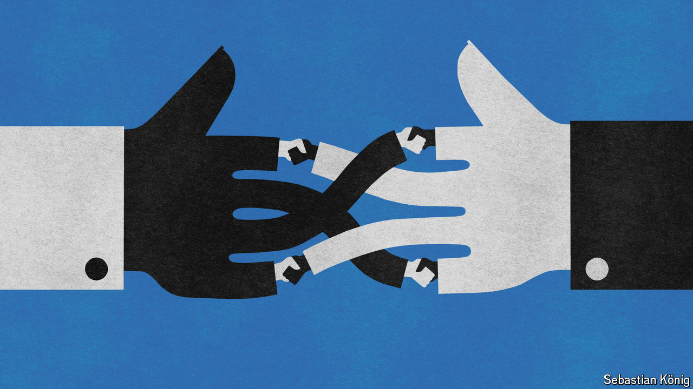

###### The art of the deal

# Rumours of the trade deal’s death are greatly exaggerated 

##### Plenty of countries are in a dealmaking rush 

 

> Jun 13th 2024 

In some parts of the world, not least America’s capital, “trade” is a dirty word. Both Donald Trump and Joe Biden now champion , and neither president signed a single new trade deal. The World Trade Organisation (WTO) is a shell of its former self. So you might think that trade deals are history—but in fact, from South Asia to Latin America, dealmaking continues apace.

To understand the new landscape, start with the birth of the modern trade deal. The first half of the 20th century saw escalating tariffs and two world wars. Then, in 1948, the General Agreement on Tariffs and Trade (GATT) was signed in an effort to temper zero-sum competition. The construction of the World Trade Organisation (WTO), which formalised continuous negotiations, followed in 1995. One of its core principles is the “most-favoured nation” clause: if you change tariffs on one country, you must do so for all the others, too. 

