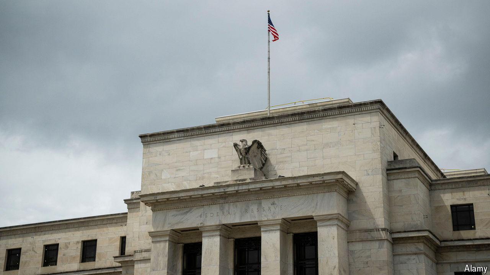

###### The missing million

# The cracks in America’s ultra-strong labour market 

##### With a big discrepancy in jobs data, the economy may be weaker than it seems 

 

> Jun 13th 2024 

It is the million-person mystery, and its solution will help determine just how strong American growth truly is. According to an official survey of employers, America’s economy has added 1.2m jobs in net terms since the start of the year. But a separate survey of households paints a completely different picture: that the country has in fact shed about 100,000 jobs over the same time period.

Slight discrepancies between the two closely watched surveys are normal, but rarely has the gap been so wide. One suggests a robust economy that is coping just fine with high interest rates; the other, that growth is rapidly decelerating.

