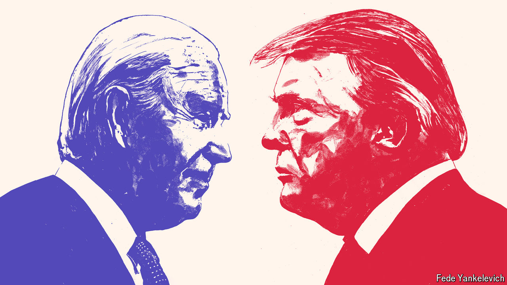

###### The Economist’s US election model

# A second Trump term: from unthinkable to probable 

##### Introducing our 2024 American election forecast model 

 

> Jun 13th 2024 

WHEN DONALD TRUMP left office in January 2021 his political career seemed over. It was not just Democrats who thought so. “We are very, very close to being able to ignore Trump most nights,” wrote  privately when he was still the host of Fox News’s most popular evening show. “I truly can’t wait.” Mr Carlson did not get his wish. Our statistical forecast, , gives Mr Trump a two-in-three chance of winning in November. This is the same model, plus some refinements, that made Joe Biden a strong favourite to become president in 2020. Tested on election data from previous elections (with no knowledge of the outcome), the model gave Barack Obama about the same chance of winning in 2012 at this point in the race as it gives Mr Trump now. Like , it thought Hillary Clinton likelier to win in 2016—a reminder that models, though they offer a rigorous way to think about the world, are not crystal balls. 

 


