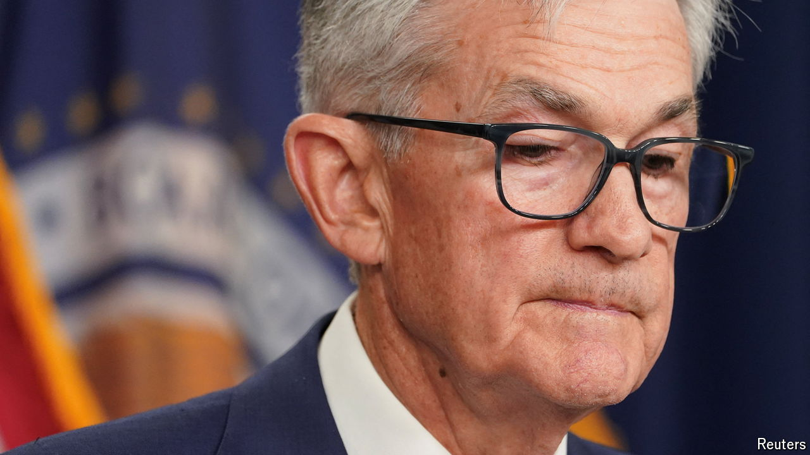

###### Economic exceptionalism

# America seems immune to the world economy’s problems 

##### Elsewhere, political dysfunction and fiscal frailties are taking a toll 

 

> Jun 12th 2024 

Add monetary policy to the list of ways in which  stands out. Central banks in Canada, Sweden and the  all recently began cutting interest rates. Yet the Federal Reserve on June 12th again postponed its plans for monetary loosening. Even though rates in America have risen higher than in other big rich countries and inflation is falling, the median Fed rate-setter expects a cut of just one quarter of a percentage point this year.

Some monetary divergence is the natural consequence of America’s stronger growth. But what is striking about America is how immune its markets appear to be to the threat of political dysfunction and fiscal frailty. By contrast, in the rest of the world those factors are weighing increasingly heavily.

