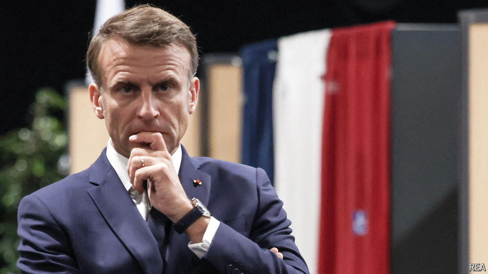

###### Double or quits

# Emmanuel Macron wants a snap election to get him out of a deep hole 

##### But he’s taking a big risk 

 

> Jun 10th 2024 

SOMETIMES YOU have no choice but to roll the dice. That is where France’s president, Emmanuel Macron,  on the night of June 9th. He had just received a thumping in elections to the , in which the National Rally (RN), led by Marine Le Pen, won twice as many votes as his own party, Renaissance. Already, in his own national parliament, he has to govern with a minority, cobbling together support as best he can to get his government’s domestic legislation through. The boost to Ms Le Pen’s standing from her big Euro-win risked making him a lamer duck than ever, with the very real prospect that the opposition would anyway force an election later in the year by voting down his budget.

It was an untenable position. As in the United States, French presidents cannot pass much of their domestic agenda without a majority in the legislature. At the moment, Mr Macron’s party has no majority, but neither can anyone else form a majority government. And so he seized the initiative by calling a snap election at the end of this month, a full three years early.

