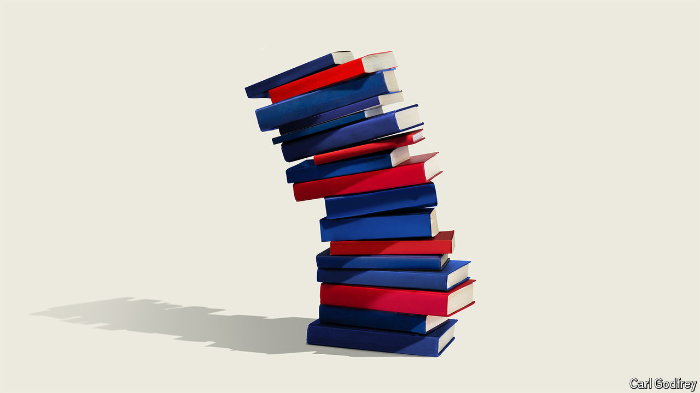

###### Setting sales

# If a bestseller list shuns authors it dislikes, it should say so 

##### Bestseller lists are supposed to reflect sales, not political ideology 

 

> Jun 13th 2024 

People love lists. The 1,000 richest people, the 100 places to see before you die, the ten most-wanted fugitives;  promise to make the chaos of life more manageable. Benjamin Franklin was a superfan, using lists to explain everything from the 13 virtues necessary to be successful to eight reasons to choose an older woman as a lover. 

Since the first list of bestselling books was published in America in 1895, critiques have piled up like the stacks beside a bibliophile’s bed. In 1932 M. Lincoln Schuster, a co-founder of Simon &amp; Schuster, a publisher, warned that: “The current procedure for compiling…the so-called ‘bestseller’ lists has led to many abuses.” He argued that cumulative sales should count. Currently, only “fastsellers” qualify, leaving the most popular book of all time, , out of the rankings. 

