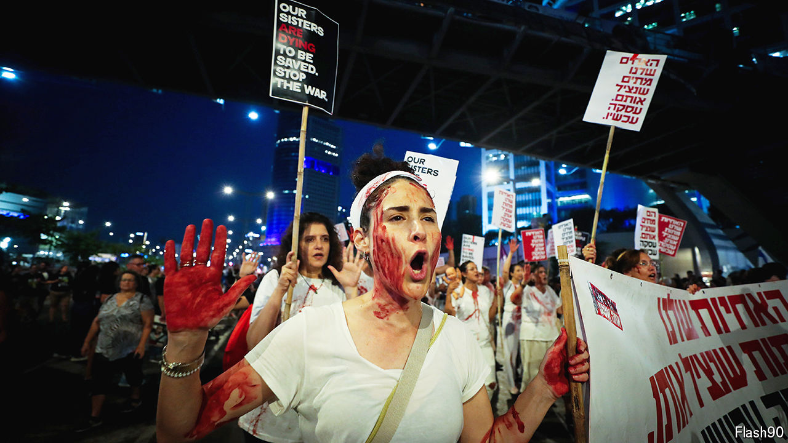

###### A bridge too far?

# Hamas and Israel are still far apart over a ceasefire deal 

##### For all America’s optimism, the two sides look fundamentally irreconcilable 

 

> Jun 12th 2024 

The euphoria in Israel at the rescue on June 8th of four hostages who had been captive in Gaza for eight months was short-lived. Senior Israeli officers rushed to extol the commandos who carried out the mission, one of whom was killed, and the accurate intelligence that located the two apartments in the crowded Nuseirat refugee camp where they were incarcerated. But officials were just as quick to dampen expectations that the remaining 120 Israeli hostages held by Hamas could be rescued in a similar fashion. 

It was a “unique combination of intelligence and operational circumstances”, explained one general. But Israeli security officials still reckon that a deal will have to be struck with their enemies if most of the remaining hostages kidnapped by Hamas on October 7th are to be freed.

