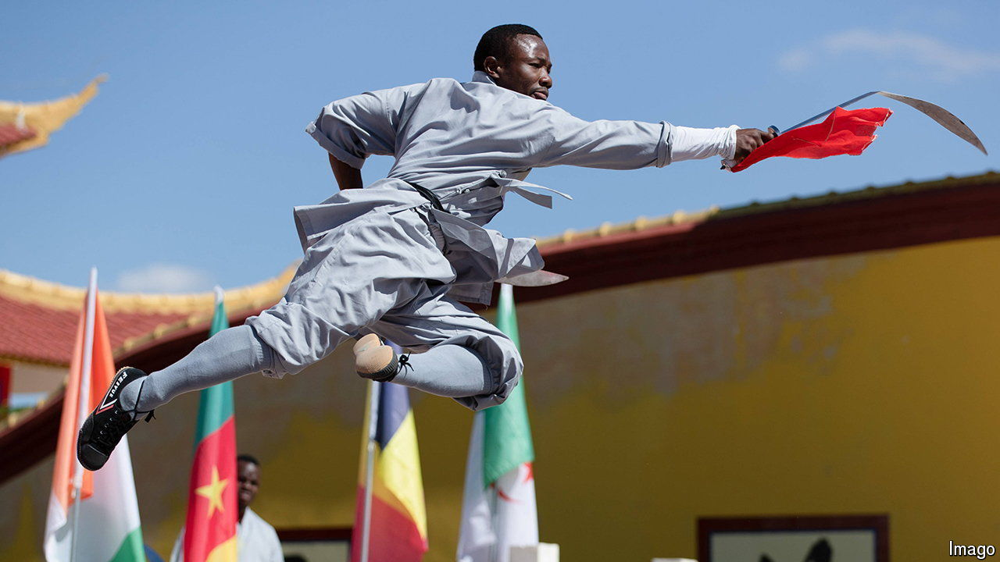

###### High kicks

# Kung fu gives Africans their kicks 

##### A rare soft-power export from China is spreading across the continent 

 

> Jun 13th 2024 

Master Mfaume, who heads the biggest kung fu temple in Tanzania, has become a social-media pin-up, with short films of himself and his students showing off their lightning moves. TikTok videos that display them whizzing along walls or fighting bullies in the suburbs of Dar es Salaam, the country’s biggest city, have won 184,000 likes. Master Mfaume says more and more Tanzanians want to study the sport. “People are starting to learn kung fu eagerly—and the number of students is going up a lot.” 

Kung fu was brought to Africa in the 1970s by a shadowy Taiwanese figure known as Mr Ming. He popularised Bruce Lee’s martial arts, screening films in shabby township cinemas in South Africa, where audiences loved his message of opposition to white supremacy, cheering as he smashed a sign by a park in Shanghai that read “No Dogs and Chinese Allowed”. 

