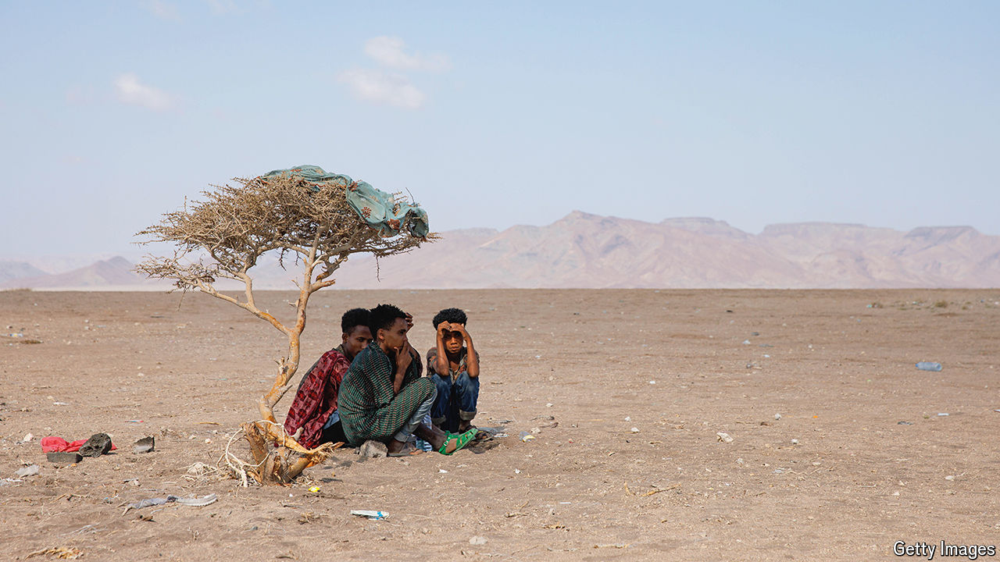

###### Out of Africa

# The deadly journey to the Gulf 

##### Migrants from Ethiopia to Saudi Arabia risk drowning, extortion and violence 

 

> Jun 13th 2024 

In the beginning, before the desert and the sea, before the beatings and the body, all he had was a phone number. Abdro was working on a building site in Ethiopia when another labourer told him how to contact a , a broker, who could get him to Saudi Arabia. He was 19 years old, with an ailing father, seven siblings and no prospects, so he made plans to leave.

Abdro (we are using just one name for his protection) followed the well-trodden trail from the Horn of Africa to the Arabian peninsula, dreaming of a better life. Last year the UN’s International Organisation for Migration (IOM) counted migrants crossing borders, generally irregularly, 380,000 times along this Eastern Corridor, including more than 96,000 arrivals on the Yemeni coast. (About 230,000 crossed the Mediterranean.) Migrants often encounter extraordinary levels of exploitation and violence, their quiet courage unnoticed.

