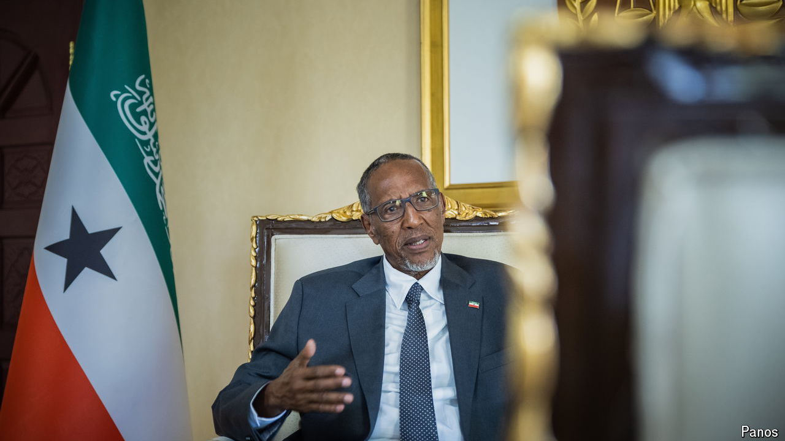

###### Deal or no deal

# The president of Somaliland is bargaining for recognition 

##### But a war at home has not helped his case 

 

> Jun 13th 2024 

The text is secret and the deal might yet fall through. But the memorandum of understanding signed by Ethiopia and Somaliland on January 1st has sent shock waves through the Horn of Africa. Somaliland, which declared its independence from Somalia in 1991, says that Ethiopia will become the first country to grant it recognition. In return, it will give its landlocked neighbour access to the sea.

The deal has outraged Somalia, which describes it as an act of “aggression”. In April it expelled the Ethiopian ambassador. Now it is threatening to do the same to more than 8,000 Ethiopian soldiers who are stationed on its soil to fight al-Shabab, a jihadist group linked to al-Qaeda. But in Somaliland, a de facto state with its own government, flag, army, currency and courts, the mood is very different. “We are struggling for our independence, as every other country in the continent…has done,” says Muse Bihi Abdi, the president of Somaliland, speaking to  in Hargeisa, the capital.

