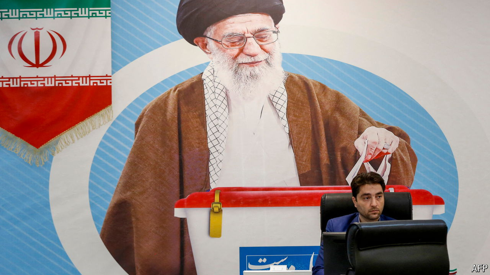

###### Slender hope

# Who are the main contenders to be Iran’s next president? 

##### After the death of the puritanical president, Iran’s reformists hope to win a slice of power 

 

> Jun 10th 2024 

AFTER THREE years of ruthless hardline government under Ebrahim Raisi, Iran’s 61m voters  for president. Ahead of Iran’s snap presidential election, scheduled for June 28th, the Islamic Republic’s electoral-vetting body approved six candidates: three hardliners, two pragmatic conservatives and a reformer. Given that the first five are likely to split the traditionalist vote, a good turnout might even propel a reformist back into the presidency. The helicopter crash that  on May 19th “could re-energise Iranian politics”, says a political observer in the capital, Tehran.

The front-runner is a pragmatic conservative, Mohammad Baqer Qalibaf. As a former military commander and police chief, speaker of parliament and an ally of the supreme leader, Ayatollah Ali Khamenei, he has the credentials of a regime stalwart. If the other four conservatives drop out of the race and lend him their backing (as often happens in Iranian elections), he should be a shoo-in. That said, as a previous three-time presidential contender, he also has a record as a loser. Critics berate him over corruption allegations—which he denies—and hypocrisy (though Mr Qalibaf condemns the West, his son applied for Canadian citizenship). 

