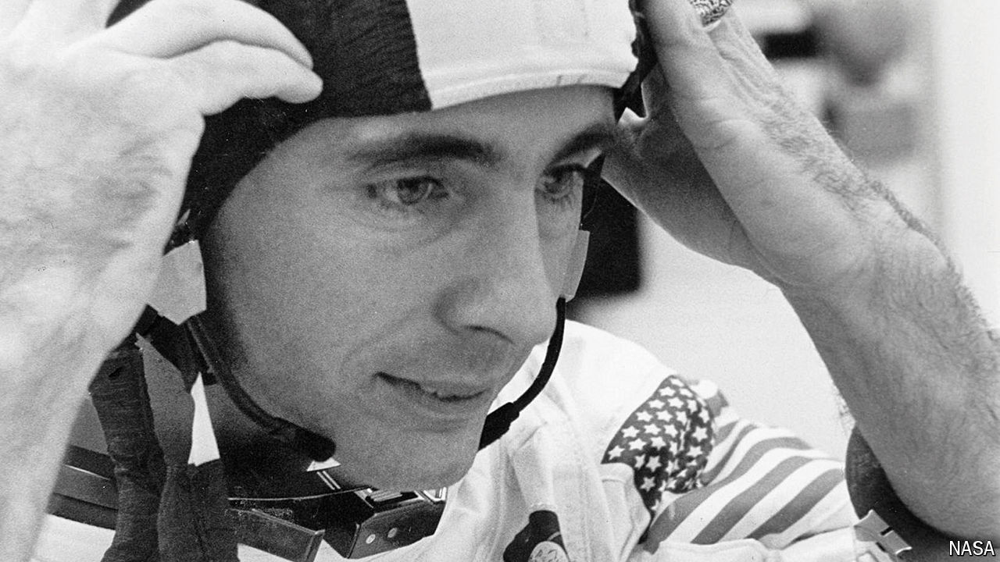

###### Out of the window, Earth

# William Anders took the photo that kicked off the environmental movement 

##### The Apollo 8 astronaut and nuclear engineer died on June 7th, aged 90 

 

> Jun 12th 2024 

For a while, Bill Anders had high hopes of landing on . He test-drove the lunar-landing training vehicle and, as a keen amateur geologist, he wanted a closer look at . Yet the mission he actually went on, Apollo 8, was never intended to land there. It was originally an Earth-orbit checkout of the lunar module and, when the module was delayed, NASA took the bold step of turning Apollo 8 into a manned reconnoitering flight round the Moon. Human beings had never left Earth orbit before. Major Anders reckoned there was one chance in three they wouldn’t come back, and two in three that the mission would be aborted. It wasn’t, mostly because NASA wanted to get a spacecraft into lunar orbit before the Commies did. 

He was sorry to fly without the lunar module and, as it turned out, pretty disappointed with the Moon itself up close. “Boring”, “stark”, “beat-up”, “ugly”, were the words that sprang to mind. Forget the poetry. The first human view of the back of the Moon was so intensely black that it put up the hairs on the back of his neck. The first lunar sunrise was interesting, with low rugged mountains showing through a purplish haze, but beyond that it looked like nothing so much as a grey, dirty beach. 

