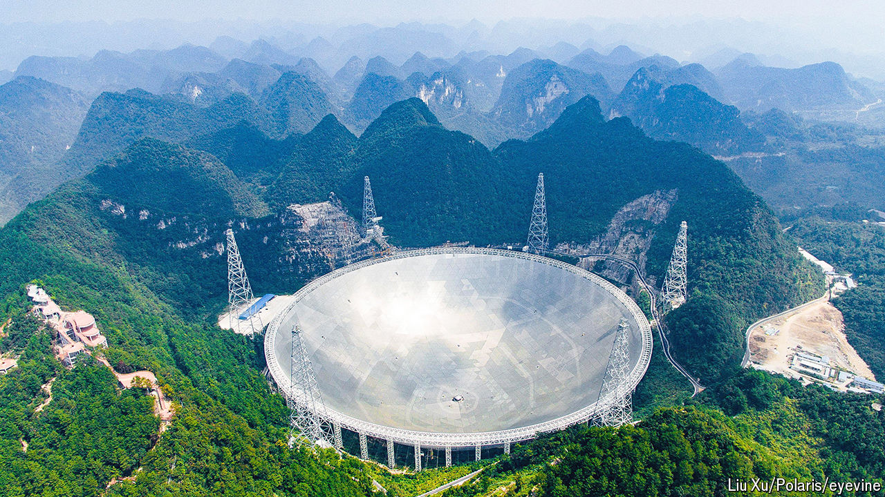

###### Red moon risen

# China has become a scientific superpower 

##### From plant biology to superconductor physics the country is at the cutting edge 

 

> Jun 12th 2024 

In the atrium of a research building at the Chinese Academy of Sciences (CAS) in Beijing is a wall of patents. Around five metres wide and two storeys high, the wall displays 192 certificates, positioned in neat rows and tastefully lit from behind. At ground level, behind a velvet rope, an array of glass jars contain the innovations that the patents protect: seeds.

CAS—the world’s largest research organisation—and institutions around China produce a huge amount of research into the biology of food crops. In the past few years Chinese scientists have discovered a gene that, when removed, boosts the length and weight of wheat grains, another that improves the ability of crops like sorghum and millet to grow in salty soils and one that can increase the yield of maize by around 10%. In autumn last year, farmers in Guizhou completed the second harvest of genetically modified giant rice that was developed by scientists at CAS. 

