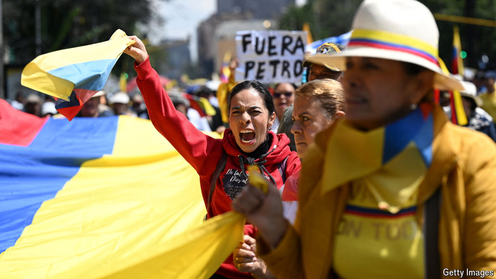

###### Leaving behind compromise

# Colombia’s leftist president is flailing 

##### His attempts at reform are increasingly infuriating Colombians 

 

> Jun 13th 2024 

Colombia’s first avowedly left-wing president came to power in August 2022 promising to reduce inequality in one of the world’s most unequal countries. Since taking office Gustavo Petro has been pushing through a series of reforms in pursuit of this goal. In particular, Mr Petro wants changes to health care, labour and the pension system. 

But almost two years into his term, the bills underpinning his signature reforms have stalled. There is opposition in Congress and on the streets. Mr Petro is losing patience. He is pressing Congress to pass the laws before the end of the legislative session on June 20th. His moderate allies are attempting to rein him in, lest his intransigence push his approval below the 34% it has been stuck at for months.

