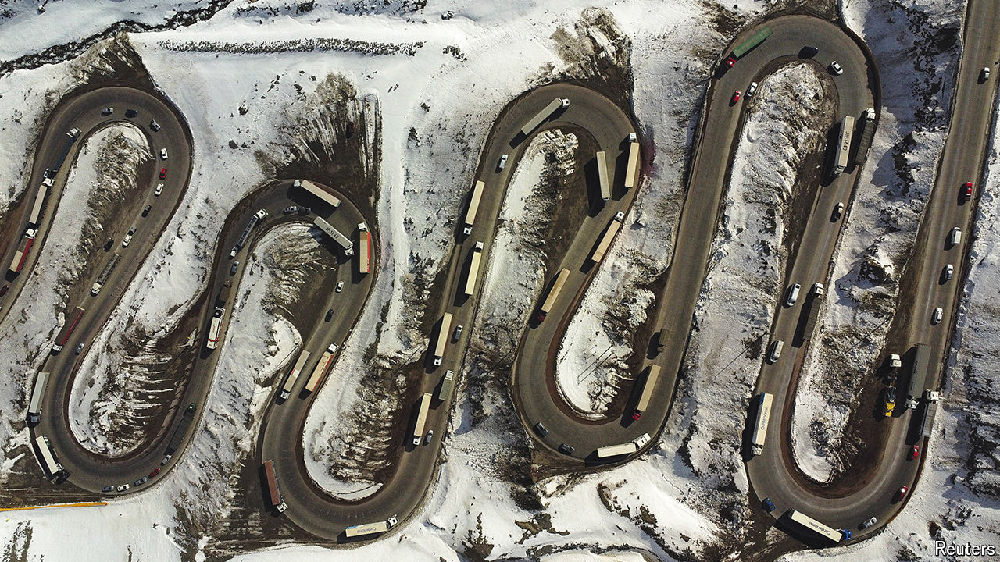

###### Embrace the neighbours

# Latin America is the world’s trade pipsqueak 

##### The world’s longest mountain range and largest tropical rainforest make commerce a challenge 

 

> Jun 13th 2024 

Follow a lorry laden with Brazilian-made cars as it inches down the hairpin bends of the Paso Internacional Los Libertadores (pictured) into Chile and the challenges of trade within Latin America become clear. Four times the lorry grinds to a halt as workers repair the road ahead; snow, ice and avalanches will soon smash it up again. The delays are so long that drivers hop out to smoke, staring up at the surrounding peaks. There is at least one crash a week, reckons a border official. This is the busiest trade crossing between Argentina and Chile, but treacherous ice means in winter it operates for just 12 hours a day. For about 40 days of the year, smothered in snow, it shuts altogether.

Latin America’s international trade, measured as exports plus imports as a share of GDP, has crept up over the past two decades, but it still trails most emerging markets. Strip out Mexico’s super-strength in manufacturing for export to the United States and the picture is even worse. In South America trade in goods is worth less than 30% of GDP. In other emerging markets it is worth around 50%. 

