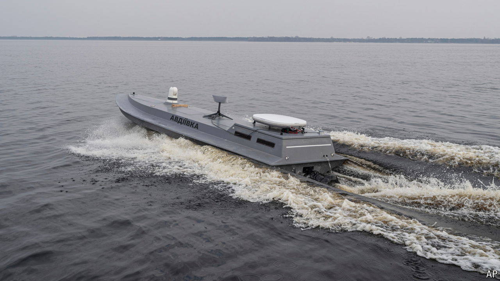

###### The Economist explains

# Ukraine has a navy that needs no sailors 

##### It does a surprisingly good job of destroying Russian vessels 

 

> Jun 12th 2024 

WHEN RUSSIA invaded in February 2022 Ukraine barely had a navy. The defenders scuttled their one frigate to prevent Russia from seizing it. Two years later Ukraine is struggling to hold back a Russian offensive on land—but it is winning the war  and has broken the Russian blockade of its grain ships. Its victories have often depended on rapid technological innovation: every other navy relies on crewed ships to fight, but Ukraine has built a fleet of drone boats, or uncrewed surface vehicles (USVs). How are they shaping the war at sea? 


