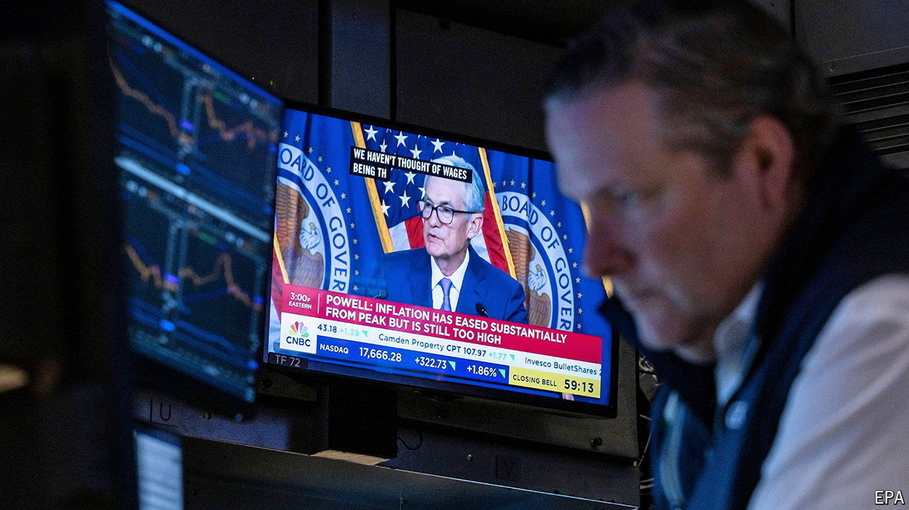

###### The world this week

# Business 

#####  

 

> Jun 13th 2024 

The  left its benchmark interest rate on hold at a range of between 5.25% and 5.5%. Markets were more interested in the latest moves along its path for rate reductions. The Fed now thinks it will cut just once this year, possibly as late as December, a big change from March, when it predicted three cuts. On June 6th the  cut interest rates for the first time in five years, shaving a quarter of a percentage point off the deposit facility, to 3.75%.

America’s labour market  again, adding 272,000  in May, far above analysts’ forecasts and the second-biggest monthly addition of employees to the payrolls this year. The annual rate fell to 3.3%.

