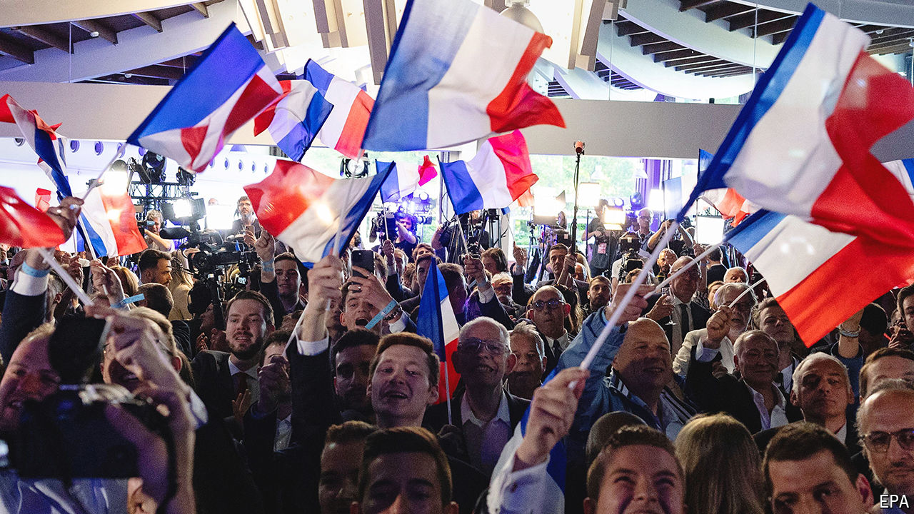

###### The world this week

# Politics 

#####  

 

> Jun 13th 2024 

Elections to the  saw the hard right making the most gains overall, though the European People’s Party, representing the centre-right, and the Socialists and Democrats, on the centre-left, remain the biggest voting blocs. Green parties lost a quarter of their seats. In  Marine Le Pen’s right-wing National Rally took a third of the vote, more than double that of Emmanuel Macron’s party, Renaissance. In a surprise announcement, the French president dissolved the National Assembly and called a snap election. Mr Macron lost his parliamentary majority in 2022, and says the country now “needs a clear majority in serenity and harmony”.

 governing coalition also got a shellacking at the election. The opposition Christian Democrats came first and the nationalist Alternative for Germany (AfD) second, beating all three parties in the government. The Social Democrats, the party of Chancellor Olaf Scholz, took just 14%, its worst showing ever in a national poll. The AfD’s biggest increase in support was among people aged 16-24, in an election where 16-year-olds were able to vote for the first time.

