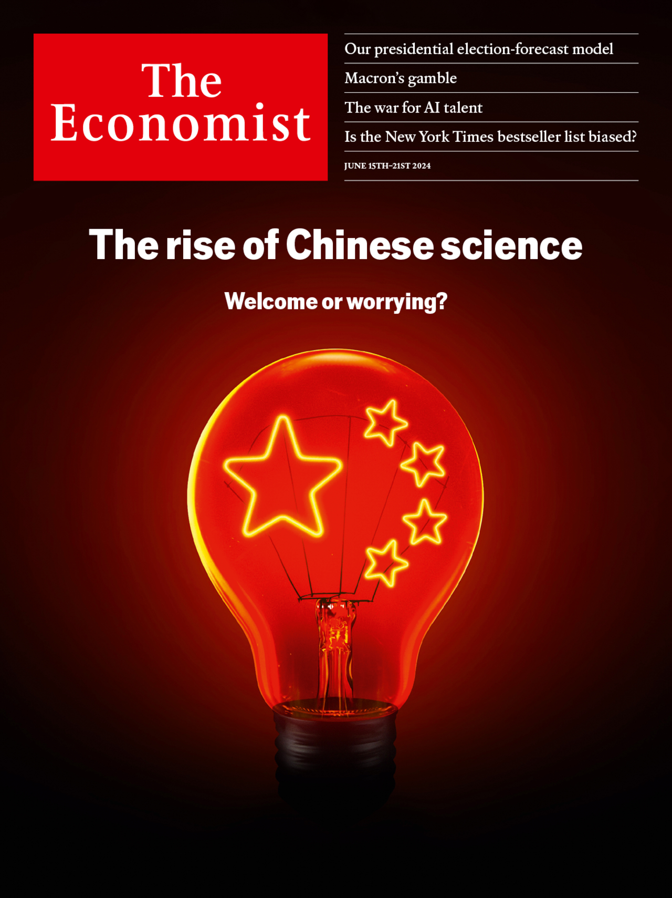

###### The Economist

# This week’s cover 

##### How we saw the world 

> Jun 13th 2024 

OUR WORLDWIDE cover this week contemplates the rise of Chinese science and whether it is something to be embraced or feared. America’s use of a mix of export controls and sanctions to prevent China from gaining a technological advantage is unlikely to work. As our reporting shows, Chinese science and innovation are making rapid progress. If America wants to maintain its geopolitical, economic and military superiority—and to get the most benefit from the research of China’s talented scientists—it would do better to focus less on keeping Chinese science down and more on pushing itself ahead.

 


