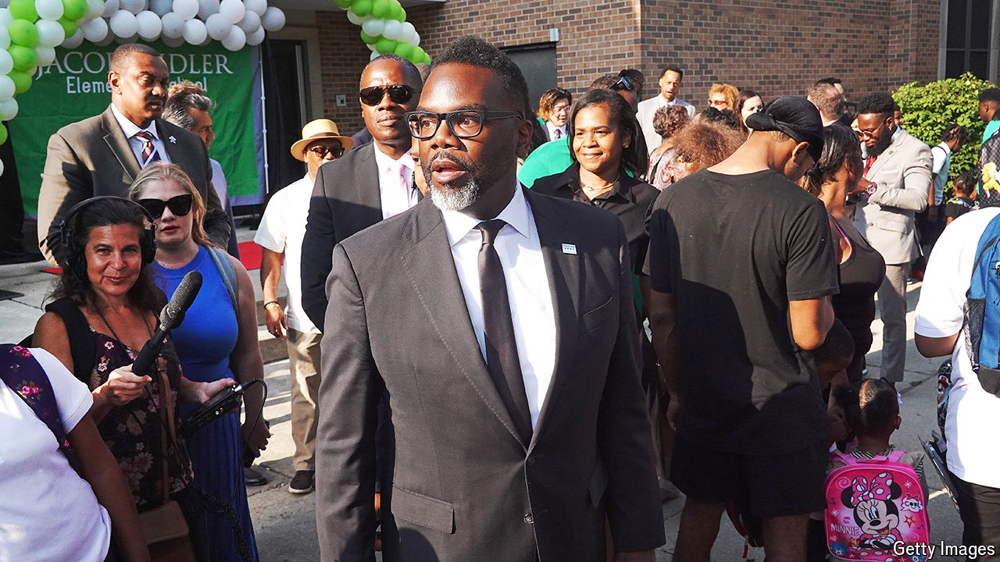

###### No promised land

# Brandon Johnson, Chicago’s leftist mayor, is struggling 

##### Incompetence rather than ideology is what’s hurting him 

 

> Jun 9th 2024 

There are not many cities in the world where the local government puts on a house-music festival—and even fewer where it would be as delightful as the one held in  over the first weekend of June. On a sunny Sunday people of all races and ages filed into Millennium Park downtown, many clutching blankets, coolers and camp chairs. One attendee, however, was clearly not welcome. At sunset the headliner, Farley “Jackmaster” Funk, a storied Chicago DJ, invited on a special guest. As Brandon Johnson, the mayor, jogged onto the stage, a chorus of boos rang out. Within 45 seconds he had left, his seemingly truncated message that Chicago is “the greatest frickin’ city in the world” not enough to silence the din of dissent.

Booing politicians is a tradition in the Windy City (savvier ones know the best time to appear is early, before the crowd starts drinking). Yet Mr Johnson, who won a surprising election victory last year, is already unusually unpopular. According to a poll conducted in late April, a year after his election, just 9% of Chicago residents consider him to be doing an “above average” job; a majority say his work is below average. Even among non-white voters—his base—below-average ratings outnumber above-average ones by four to one. 

