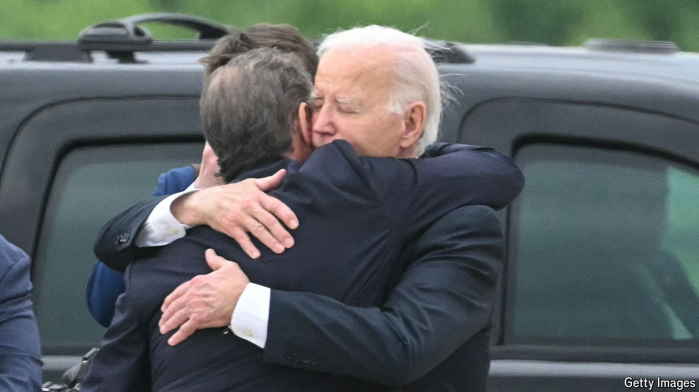

###### Guilty as charged

# Hunter Biden’s criminal conviction is good for nobody politically 

##### The trial showed the ruin of addiction, and the wheels of justice turning 

 

> Jun 12th 2024 

Last year almost 16m  were sold in the United States. According to a government survey, 16% of adults have used  in the past month. People buying a gun must fill in a seven-page federal form. Question 21f asks: “Are you an unlawful user of, or addicted to, marijuana” (or any other illegal drug)? Almost certainly hundreds of thousands of people lie on the form, which is a felony. In a typical year, fewer than 300 are prosecuted. 

This year  became one of them. On June 11th the president’s wayward son was convicted on all three charges against him, after a six-day trial. In October 2018 he bought a Colt revolver at a gun shop in Wilmington, Delaware. At the time he was, a jury decided, addicted to crack cocaine. In theory he could now be sentenced to as long as 25 years in prison. 

