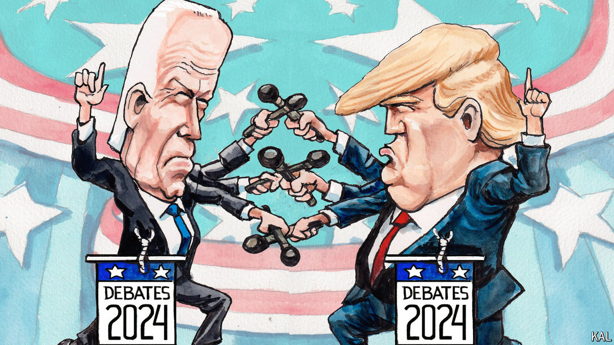

###### Lexington

# Joe Biden’s best chance to shake up the race 

##### But in debating Donald Trump, he faces graver public doubts and a greater challenge than he did in 2020 

 

> Jun 13th 2024 

To rewatch the two debates of the presidential campaign in 2020—an undertaking no kind person would recommend—is to encounter, amid the insults, two rather poignant moments. In each debate Donald Trump, then president, predicted that vaccines against covid-19 would be available by the end of 2020. Each time, moderators confronted him with his own advisers’ doubts, while his rival, , called him a fantasist if not a liar. “There’s no prospect that there’s going to be a vaccine available for the majority of the American people before the middle of next year,” Mr Biden scoffed in the second debate, on October 22nd. 

In fact, in what in an alternative political universe might shine as a model of public service by successive administrations, Mr Trump’s Operation Warp Speed supplied vaccines in December, and President Joe Biden’s programme to distribute them delivered 200m vaccinations before May 2021. How different might American attitudes be about their politics and government if each president was able to applaud the work of the other? 

